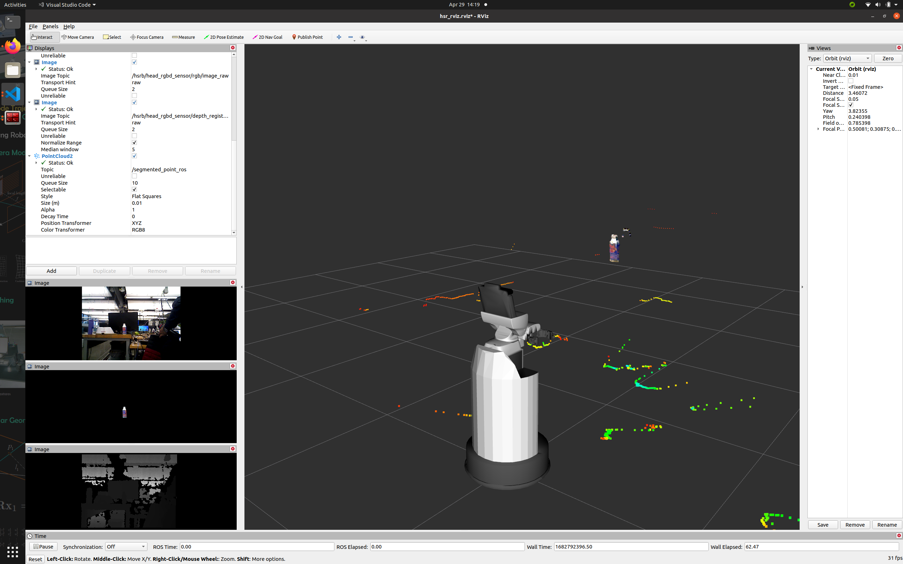

# Real-Time implementation of Deep Net models for point cloud object classification
### Introduction
Recent research in Deep Net models in point clouds and their ability to perform classification, scene segmentation, part segmentation and grasp pose detection rather than depending on trivial methods like RANSAC and PCA and utilizing multiple methods for common objective of grasping, we plan to use only two Deep Learning models for all tasks.
<hr/>
### Proposed models
Papers like PointNet, PointNet++, Dynamic Graph CNN, etc. propose some 
state of the art methods for object classification, though it's not clear on how to implement these models in real-world and how to bridge the sim2reeal gap efficiently.
<hr/>
### 2D to 3D detection
We leverage existing 2D image segmentation methods (Mask-RCNN), once the object with desired label is selected, the point clouds are generated with the depth map and rgb frame using correspondance. Further these generated point clouds can be passed to desired deep net models for either object detection, classification, segmentation or grasp detection.

<hr/>
### Installation and Execution
```
mkdir -p ~/proj-2d-3d/src
cd ~/proj-2d-3d/src
git clone https://github.com/alpharomeo911/projecting-2d-image-to-3d.git
cd ..
catkin build
source devel/setup.bash
# Optional - BEGIN
echo "source ~/proj-2d-3d/devel/setup.bash" >> ~/.bashrc
source ~/.bashrc
# Optional - END
roslaunch hsr_cnn_detectron hsr_cnn_realsense.launch
```
The above program is tailored for RealSense Cameras, you'll need to modify the camera intrinsics in the `hsr_cnn_realsense.launch` file (performing intrinsic callibration is recommended!).
**The realsense launch file depends on RealSense ROS**
The launch file can be modified with custom rgb and depth topics, and respective base link.
<hr/>
### Published Topics
The program publishes two topics namely `/segmented` and `/segmented_point_ros`, where `/segmented` is the output from Mask-RCNN and `/segmented_point_ros` outputs the point cloud.
<hr/>
### Improvements
There are lot's of things which can be improved and are under development as we speak, but any feedback is appreciated via email or the issues section. 